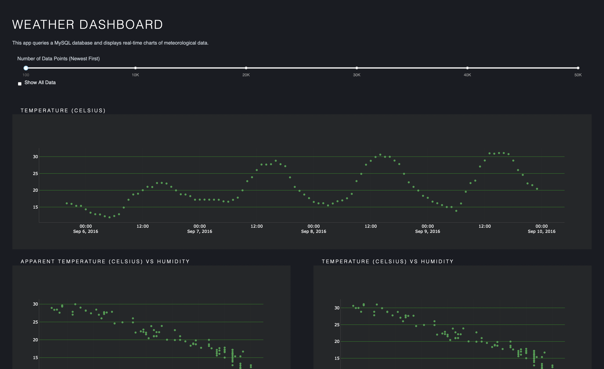

## WeatherAlytics

WeatherAlytics is a Python driven IoT Data Visualization platform for meteorological data.

## Project Status

`Completed ✅`

## How to Use

Local Environment and Build
- Configure a local MySQL instance
- Clone the repository to your local system
- Set up python environment with prerequisites with - `pip3 install -r requirements.txt`
- Remove private import and add your MySQL configuration to `connection.py`
- Modify `importdb.sql` to point to the correct CSV location and execute it to configure your database
- Run `app.py` through terminal to start the DASH server
- Open a browser and go to `http://127.0.0.1:8050`

## Plugins and Tools

WeatherAlytics is developed using Python with DASH and Plotly components. The following list of plugins have been used:

- [DASH](https://pypi.org/project/dash/) - Modern web framework for Data Science applications
- [MySQL](https://www.mysql.com) - Simple relational database
- [Plotly](https://plotly.com) - Graphs, Diagrams and Low-Code DASH implementation
- [pandas](https://pandas.pydata.org) - Data Analysis and Manipulation
- [Google Colab](https://colab.research.google.com/) - Speedy ML model creation
- [pickle](https://docs.python.org/3/library/pickle.html) - Easy serialization/deserialization for trained models
- [scikit-learn](https://scikit-learn.org/stable/) - ML and Data Science package